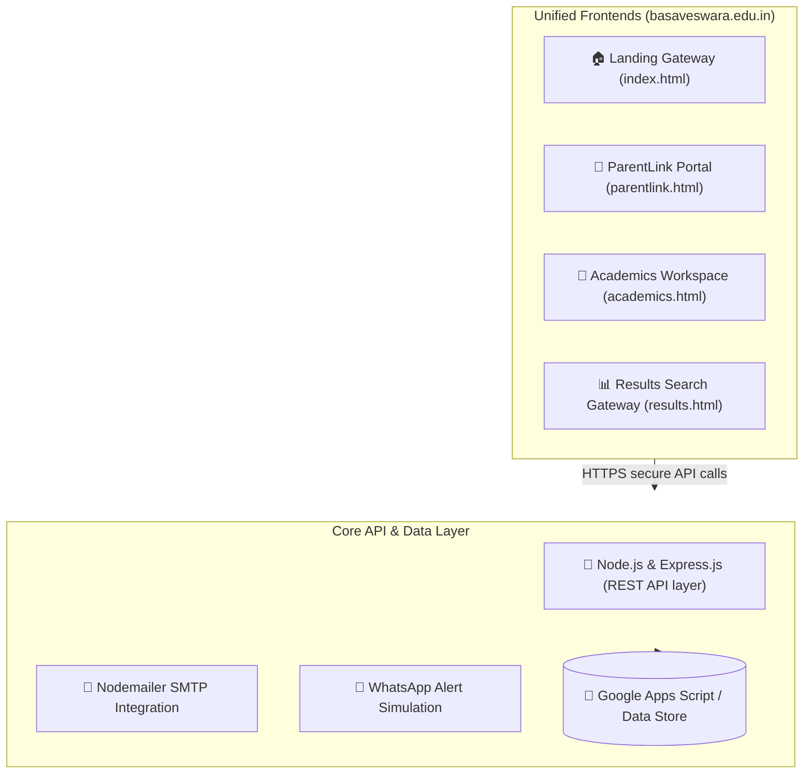

# 🏫 Sri Basaveswara School - Next-Gen Educational ERP System

> A comprehensive, highly advanced school enterprise resource planning (ERP) platform built with a high-fidelity role-based authentication layout and path-resilient design.

---

## 🌟 Overview

This custom-built ERP system digitalizes and streamlines school administration, financial management, academic scheduling, and parent communication into a single, cohesive platform with a modern, responsive UI. It is designed specifically for **Sri Basaveswara School** (Target Domain: `basaveswara.edu.in`).

## ✨ Key Features

### 💰 Financial Management
*   **Dynamic Fee Ledgers**: Automated tuition fee tracking, recording, and outstanding balance calculations.
*   **Instant WhatsApp Receipts**: Integrated one-click WhatsApp sharing (`wa.me`) for instant fee receipt delivery to parents.
*   **Dynamic UPI Integration**: Automated generation of UPI QR codes on receipts for seamless fee collection.

### 📚 Academic Administration
*   **Digital Attendance Register**: Streamlined daily attendance tracking system for teachers.
*   **Dynamic Timetable Scheduler**: A robust weekly timetable manager for school administrators.

### 👨‍👩‍👧‍👦 Parent & Student Portal
*   **Visual Dashboards**: Intuitive dashboards featuring visual attendance calendars and personalized timetable grids.
*   **Transport Directory**: Real-time access to school transport routes and contact information.
*   **Official Scoresheet**: Digital official academic report cards.

---

## 🏗️ Architecture & Technology Stack

The platform is decoupled into a dynamic Express backend API server and static client portal applications.



### 💻 Technologies Used
*   **Frontend UI:** HTML5, Vanilla JavaScript, **Tailwind CSS** (for modern, responsive components).
*   **Backend API:** **Node.js** with **Express.js** for robust logic and routing.
*   **Database & Storage:** Offline simulation capabilities / Google Apps Script persistent backend functionality.
*   **Integrations:** WhatsApp API (`wa.me`), Dynamic QR Code Servers.

---

## 👥 Role-Based Access Matrix

All critical access and master control are centralized under the Super Admin role:
*   **Super Admin:** Full access to financial ledgers, system settings, and user management.
*   **System Emails:** The platform is configured to send official automated communications via SMTP.

### 👑 Super Admin Workspace (`academics.html`)
*   Financial balance sheets and ledger management.
*   Master user account and access control.
*   System audit logging and timetable scheduling.

### 🎓 Teacher Workdesk
*   Digital attendance registers.
*   Dynamic row/column grid to input batch grades.

### 🎒 ParentLink Portal (`parentlink.html`)
*   Access to fee ledgers, dynamic UPI QR codes, and WhatsApp receipts.
*   View visual attendance ring and digital report cards.

---

## 🚀 Local Installation & Sandbox Execution

The system features a **Path-Resilient Offline Sandbox Simulation System**. This allows you to test and run the frontend dashboards locally without a live backend!

### To run the server locally:
1. Clone the repository and navigate into the folder:
   ```bash
   git clone https://github.com/YOUR_GITHUB_USERNAME/school-erp.git
   cd school-erp
   ```
2. Install Node.js dependencies:
   ```bash
   npm install
   ```
3. Initialize your environment secrets by creating a `.env` file in the root directory:
   ```env
   PORT=5000
   EMAIL_USER=your-email@example.com
   EMAIL_APP_PASSWORD=your-google-app-password
   SUPER_ADMIN_EMAIL=admin@example.com
   ```
4. Start the server:
   ```bash
   npm start
   ```
   *(The server will boot on port `5000`)*

## 🌐 Production Deployment
The static frontends (`index.html`, `academics.html`, `parentlink.html`) can be hosted directly on Vercel, Netlify, or GitHub Pages. Map your custom domain (`basaveswara.edu.in`) to the hosting provider. The Node backend should be deployed to a service like Render or Heroku.
